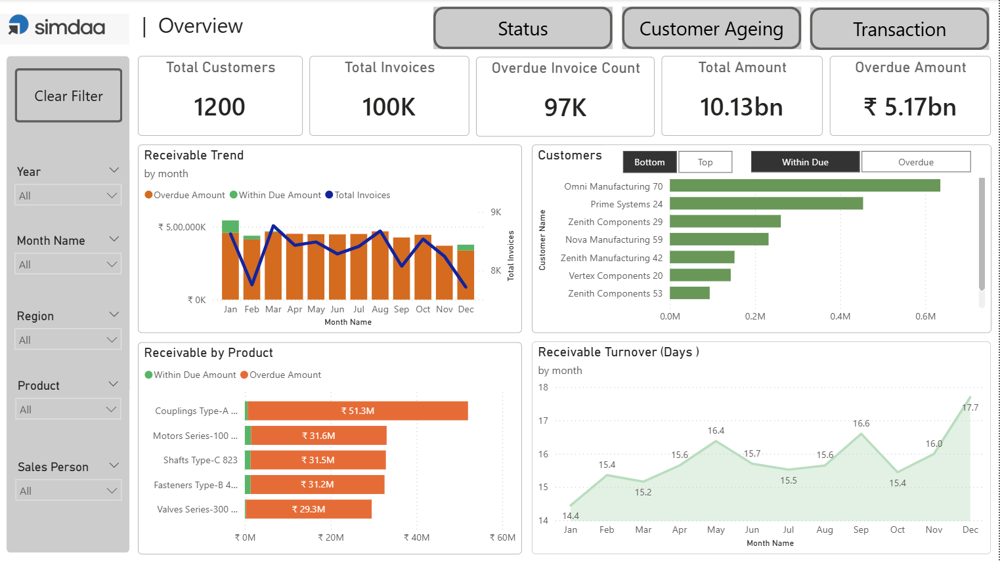
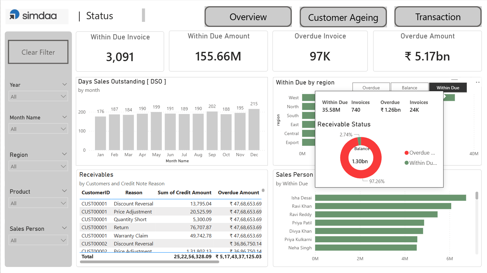
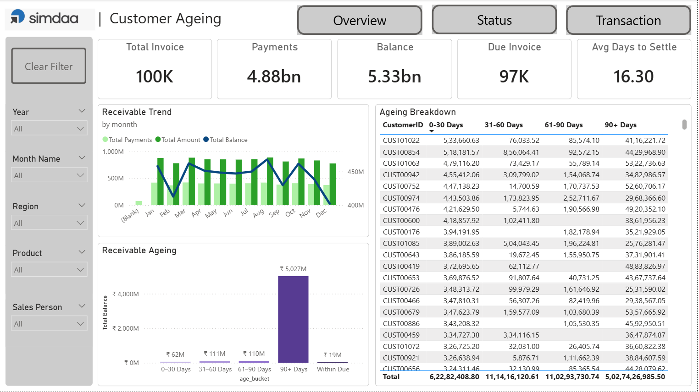
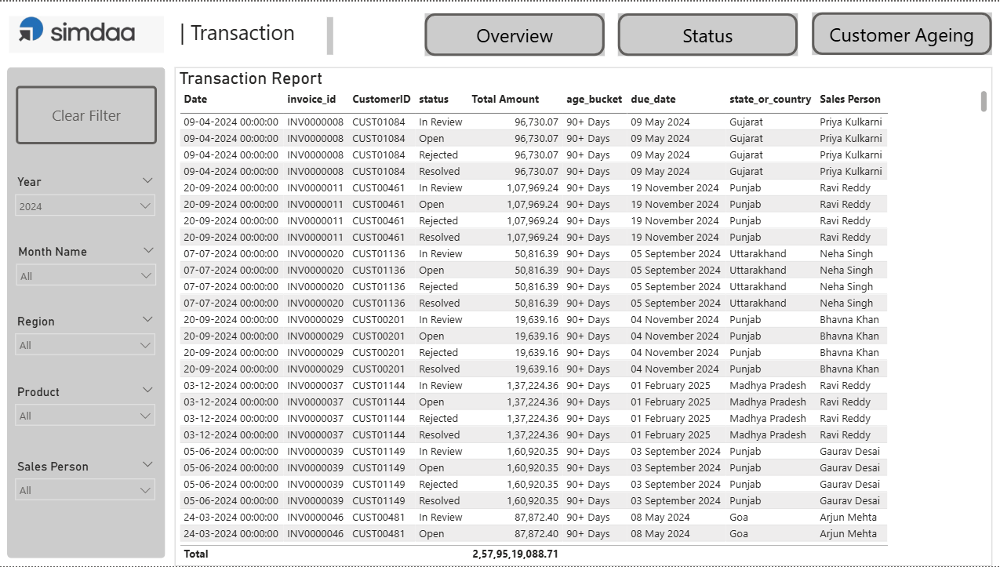

# Power BI Accounts Receivable & DSO Dashboard

This project demonstrates a financial analytics dashboard built using Power BI for monitoring accounts receivable performance.

## Features

- Accounts Receivable KPI monitoring
- Overdue invoice tracking
- Customer ageing analysis (0–30, 31–60, 61–90, 90+ days)
- Receivable trend analysis
- Days Sales Outstanding (DSO) tracking
- Salesperson performance insights

---

## Dashboard Overview

---

## Status / DSO Analysis

---

## Customer Ageing Analysis

---

## Transaction Report

---

## Tools Used

- Power BI
- DAX
- Data Modeling (Star Schema)

---

## Note

Due to confidentiality policies, only dashboard screenshots are shared.  
No client data is included in this repository.
